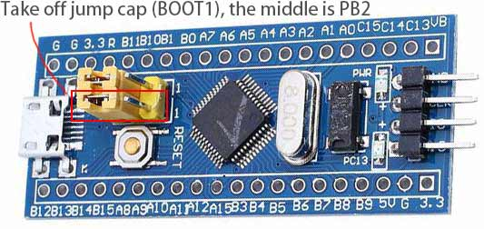

# SoftIO
A high-level MCU manipulation library through USB or any serial port, with memory sync paradigm

## Design——why software-defined and why memory sync?

### 1. why software-defined?

I developed several MCU project before I realized the necessity of a framework to communicate with PC. The requirements could vary with different project but the essential functionalities remain the same, concluded below:

1. read/write data
2. read/write stream

For example, PC may want to write data to MCU to set the DAC value, and even MCU may want to write to PC if something happened (just like interrupt). With simple read and write, one could realize most of things, however, may not suitable for high-load systems. The point is that, if you want to read ADC data at about 4Mbps but the overall throughput is limited to 6Mbps, that would be a hard problem to solve, which really occurs to me when I was developing a customized SDR (Software-Defined Radio) device on visible light communication. The continuity and packet-loss-free requirement leads to the special design of stream I/O, which exactly reach the high-load requirement above.

In my experience, developing a MCU program is annoying with long waiting of compiling, flashing, debugging. SDR inspired my that for a research project, a flexible configuration is much more valuable than compact design of MCU system. For example, although you may not want to change the timer frequency now, it would be great if you could change it only modify the program on PC, without recompiling the firmware and flashing it (possibly even debug new program). It concludes as below:

> Every parameter should be adjustable outside MCU, at least those needed

### 2. why memory synchronization?

Then how to control? For a beginner, a string parser would be easy to implement using `sscanf` on MCU, however, suffered poor performance. Others would like to use or design packet structure and decode them at MCU side, which leads to difficulty in developing and debugging. Actually I did try those methods and finally I came up with the idea of `memory synchronization`. 

For most use case, data and I/O are asynchronous, which means you may not read ADC data exactly when MCU receive your read request, but often in a fixed time interval. When you read ADC in timer interrupt, you don't know whether to throw away the data or give it to a previous read request, just save it somewhere in memory. In this condition, a memory synchronization would work if PC request to sync the data from MCU to PC, then PC would have a copy of the variable in MCU memory. It works perfectly for most of time, MCU would ignore the existing of PC, just do its own work of writing data to specific variable in memory. Then, I want to say, even those procedure call would be realized by the memory synchronization scheme, by adding hook functions for read and write. Assuming that MCU would write to GPIO when PC requests, it simply add a hook function that modify the GPIO register when the write request satisfy some requirements, e.g. exactly writing to a specific address.

### 3. packet structure

A library would not assume the data structure of memory space, like what variable are there and where are them. The library simply took the share data memory which could be represented by the starting address and the length. Assuming the maximum space of data is 1MB (this is large enough for most MCUs, even the highest-performance MCU of STM: STM32H7xx, only 1MB RAM totally), the head of a packet is a 4 byte control word, shown below, followed by data and 8bit checksum (for write operations).

```
|---- byte 0 ---| |---- byte 1 ---| |---- byte 2 ---| |---- byte 3 ---|
|-|-|-|-|-|-|-|-| |-|-|-|-|-|-|-|-| |-|-|-|-|-|-|-|-| |-|-|-|-|-|-|-|-|
|--type-|-----------------start address-------------| |----length-----|
  4 bit                   20 bit                        8 bit ( 1<=length<=254)
```

the possible `type` fields are:

- 0x0: read remote memory to local, return `0x1 + 8bit length + data + 8bit checksum`
- 0x2: write local memory to remote, return `0x3 + 8bit length` for success otherwise error
- 0x4: read remote fifo, may return less than wanted and that's fine, return `0x5 + 8bit length + data + 8bit checksum`
- 0x6: write remote fifo, return the byte that write successfully, return `0x7 + 8bit length` for successfully written length. Note that write more data than wanted to a fifo is bad behaved, and should be carefully handled.
- 0x8: clear fifo, lock-free thread safety when the slave is the writer of this fifo, success return `0x9`.
- 0xA: reset fifo, not thread safe but ensure read pointer and write pointer are set to 0 (this is mainly for memory alignment required for DMA operations), return `0xB` for success.
- 0xC: soft reset MCU. if you send 260 bytes of `0xC`, the MCU will surely reset after 1 second. This is fault recovery since badly behaved host program will kill the Soft-IO mechanism. You'll not receive any feed back by doing this and you can expect that several seconds later the MCU is reset.

## Usage——get started!

Despite all the design above, you should be able to write and read MCU memory using SoftIO library. We provide a demo on STM32F103C8T6 which costs only $5 on amazon.



STM32F103C8T6 features a internal USB full-speed controller, a 72MHz Cortex-M3 core, 64KB Flash memory, 20KB RAM size and lots of peripherals. The USB controller could be configured as CDC (communication device class) which usually show as a serial port on PC.

To program the device, you also need a ST-LinkV2 programmer which is also about $5 (you might be surprise that ST-LinkV2 is just a STM32F103C8T6 chip!), and connect it to the right side 4 pin. Note that with the USB cable connected (left in the picture), you should disconnect VCC in the right side, connecting only GND, SWDIO and SWCLK.